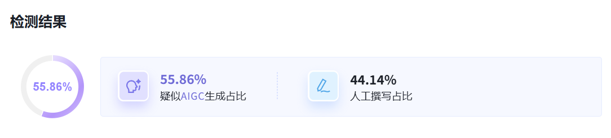
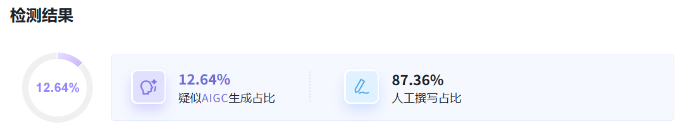

# chinese-academic-humanize

针对中文学术写作场景，降低学术文本中 AI 生成“味道”的 Agent Skills。覆盖以下模式：夸大的象征意义、宣传性语言、以 -ing 结尾的肤浅分析、模糊归因、破折号过度使用、三段式法则、AI 高频词汇、否定式排比、过多连接性短语等。

## 效果

实测维普 AI 检测，AI 率从 **55.86%** 降至 **12%**。

| 未使用该 Skill                        | 使用该 Skill 后                     |
| ------------------------------------- | ----------------------------------- |
|  |  |

## 适用场景

- 将大模型生成的中文学术文本段落改写为更自然的人类写作风格
- 投稿前自查，减少机器检测标记
- 配合维普、知网等主流查重/查 AI 率工具使用

## 使用方法

将 SKILL.md 下载导入 Agent 工具（如 Cursor、Claude Code 等），在编辑学术文本时调用该技能或要求 AI 使用即可。

也可以直接将其中的 Role / Constraints / Execution Protocol 部分复制到目标 AI 的对话框作为**提示词**使用。

## 注意事项

- 核心专业术语不会被替换，只调整句式和高频套路词
- 如果原文已经足够自然，技能会跳过修改
- 个人化痕迹（如实际踩坑经历、行话）可由用户自行补全

## 参考项目

- https://github.com/Leey21/awesome-ai-research-writing
- https://github.com/lxgicstudios/humanize-cli
- https://github.com/Imbad0202/academic-research-skills
- https://github.com/voidborne-d/humanize-chinese
